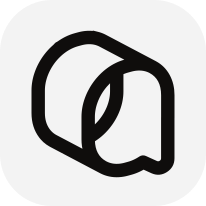

<div align="center">

# codex-z

**Your coding agents. One workspace.**

Run Claude Code, Pi, OpenCode, and other Agent Harnesses inside Codex Desktop.

[Download](https://github.com/rafazafar/codex-z/releases) · [Get started](#install) · [Documentation](docs/index.md) · [한국어](docs/project/README.ko.md)

</div>

Keep your projects, conversations, and code review in one window. Choose a Harness for each Thread. Delegate a task to another Agent and open its conversation to check the result. Each Harness keeps its own native session and tools.

codex-z is an independently maintained fork. It keeps the official Codex path and connects each external Harness through its native interface. The project is not an OpenAI product.

## Why codex-z

- **One place to work.** Keep Threads from different Harnesses in the same project sidebar. Review changes without leaving Codex Desktop.
- **Independent tasks.** Ask another Harness to review code or investigate a test while you continue your work. Delegated tasks run in separate native sessions.
- **Native behavior.** Each Harness owns its tools, context, and permissions. codex-z displays the capabilities its native interface provides.
- **Remote execution.** Run Harnesses on another machine through [SSH](docs/platforms/remote/remote-ssh-host.md). Keep the Desktop interface local. Windows [Remote Control](docs/platforms/remote/remote-control-host.md) is experimental.

## Install

macOS releases require Apple Silicon (`arm64`).

Download macOS and Windows installers from [GitHub Releases](https://github.com/rafazafar/codex-z/releases). For npm distribution on macOS, Windows, or Linux:

```bash
npm install -g @codex-z/cli
codex-z
```

The official Codex Desktop must be installed. npm selects the native package for your platform and architecture. Use the source build below if a release package is not yet available.

## Build and start

You need the official Codex Desktop, Node.js 22.19+ within major 22 or Node.js 24, npm, and the Rust toolchain specified in `rust-toolchain.toml`.

```bash
git clone https://github.com/rafazafar/codex-z.git
cd codex-z
npm ci
npm start
```

On macOS and Windows, `npm start` stops running Codex Desktop processes before it builds and starts the application. Use `npm start -- --no-build` to reuse a completed build. Use `npm run build` to build without starting Desktop.

Release package names are `@codex-z/cli` and `@codex-z/cli-<platform>-<architecture>`. The command is `codex-z`. Installers and update checks use this fork's [releases](https://github.com/rafazafar/codex-z/releases).

For platform setup, see the [Linux guide](docs/platforms/linux/linux.md), [SSH guide](docs/platforms/remote/remote-ssh-host.md), and [Remote Control guide](docs/platforms/remote/remote-control-host.md).

### Configuration and data

Use `CODEX_Z_*` for project environment variables. For a portable Windows Desktop install, set `CODEX_Z_INSTALL_ROOT` to its directory. Native Codex environment variables keep their existing names.

codex-z uses its own application identity and data paths, including `~/.codex-z` on Unix systems. It does not automatically import another application's state or accept its environment variables. Keep the existing installation and data until you have checked the new installation. Local and remote codex-z installations must use the same version.

## Feature Status

Harness capabilities depend on the native interface. See the matrix and [capability limits](docs/harnesses/capability-boundaries.md).

<details>
<summary>Show full feature matrix</summary>

| Capability | <a href="https://pi.dev/"></a> | <a href="https://github.com/can1357/oh-my-pi"></a> | <a href="https://code.claude.com/docs/en/quickstart"></a> | <a href="https://opencode.ai/docs/"></a> | <a href="https://grok.com/"></a> | <a href="https://github.com/deepseek-ai/deepseek-harness"></a> | <a href="https://antigravity.google/product/antigravity-cli"></a> | <a href="https://www.codebuddy.cn/home/"></a> | <a href="https://www.workbuddy.ai/docs/workbuddy/Quickstart"></a> | <a href="https://cursor.com/docs/cli/overview"></a> | <a href="https://hermes-agent.nousresearch.com/docs"></a> | <a href="https://qoder.com/cli"></a> | <a href="https://moonshotai.github.io/kimi-code/"></a> |
| :--- | :---: | :---: | :---: | :---: | :---: | :---: | :---: | :---: | :---: | :---: | :---: | :---: | :---: |
| Streaming responses | ✅ | ✅ | ✅ | ✅ | ✅ | ✅ | ✅ | ✅ | ✅ | ✅ | ✅ | ✅ | ✅ |
| Tool status | ✅ | ✅ | ✅ | ✅ | ✅ | ✅ | ✅ | ✅ | ✅ | ✅ | ✅ | ✅ | ✅ |
| Edit Diff | ✅ | ✅ | ✅ | ✅ | ✅ | ✅ | ✅ | ✅ | ✅ | ✅ | ✅ | ✅ | ✅ |
| Questions / cancellation | ✅ | ✅ | ✅ | ✅ | ✅ | ✅ | ✅ | ✅ | ✅ | ✅ | ✅ | ✅ | ✅ |
| Model / Thinking selection | ✅ | ✅ | ✅ | ✅ | ✅ | ✅ | ✅ | ✅ | ✅ | ✅ | ✅ | ✅ | ✅ |
| Tool approvals | ✅ | ✅ | ✅ | ✅ | ✅ | ✅ | — | ✅ | ✅ | ✅ | ✅ | ✅ | ✅ |
| Permission modes | — | ✅ | ✅ | ✅ | ✅ | ✅ | ✅ | ✅ | ✅ | ✅ | ✅ | ✅ | ✅ |
| Cross-Agent task collaboration | ✅ | ✅ | ✅ | ✅ | ✅ | ✅ | ✅ | ✅ | — | ✅ | ✅ | ✅ | ✅ |
| Usage | ✅ | ✅ | ✅ | ✅ | ✅ | ✅ | ✅ | ✅ | ✅ | — | ✅ | ✅ | ✅ |
| Fork | ✅ | ✅ | ✅ | ✅ | ✅ | ✅ | ✅ | ✅ | ✅ | ✅ | ✅ | ✅ | ◐ |
| Context compaction | ✅ | ✅ | ✅ | ✅ | ✅ | ✅ | — | ✅ | ✅ | — | ✅ | ✅ | ✅ |
| Slash commands | ✅ | ✅ | ✅ | ✅ | ✅ | ✅ | ✅ | ✅ | ✅ | ✅ | ✅ | ✅ | ✅ |
| Edit previous message | ✅ | ✅ | ✅ | ✅ | ✅ | ✅ | ✅ | ✅ | ✅ | ✅ | ✅ | ✅ | ✅ |

</details>

## Cross-Agent Collaboration

Type `#` in the chat input to choose an Agent to delegate a task to, or to find commands and skills available for the selected Harness.

Ask the current Agent to hand off a self-contained task to another Harness. For example:

> Have `#claude-code` review this change on its own and flag any compatibility risks.
>
> Have `#pi` figure out why this test is flaky.
>
> Have `#omp` implement this feature while I keep working on the docs.
>
> Have `#opencode` verify this fix in a separate Thread and run the related tests.

codex-z spins up a separate Native Session in the target Harness. It shows up in the Codex Desktop conversation list, so you can open it anytime to check progress or pick up the conversation.

<details>
<summary><h3 id="remote-harness">Remote Harness</h3></summary>

Drive Harnesses on another machine from your local Codex Desktop: tasks run remotely, the UI stays local. Both machines need the same codex-z version.

| Remote machine | How to connect |
| --- | --- |
| macOS / Linux | [SSH](#ssh) |
| Windows | [Remote Control](#remote-control-experimental) (experimental) |

#### SSH

Before you start, add the remote machine in Codex Desktop under **Settings → Connections → SSH**. Your local machine can run macOS, Linux, or Windows.

1. Install and start codex-z on the remote machine:

   ```bash
   git clone https://github.com/rafazafar/codex-z.git
   cd codex-z
   npm ci
   scripts/install-local.sh
   codex-z remote install
   codex-z remote start
   codex-z remote status
   ```

2. On your local machine, launch Codex Desktop through codex-z and open the SSH workspace.
3. Pick a Harness from the composer's Agent / Model selector.

[SSH setup, diagnostics, and uninstall →](docs/platforms/remote/remote-ssh-host.md)

#### Remote Control (Experimental)

Use Harnesses on a Windows machine from another computer, built on the pairing and sign-in of Codex Desktop's official Remote Control.

Before you start, make sure official Remote Control can already run Codex tasks. No public services or ports are opened, and Harness credentials never leave the Windows machine.

[Remote Control setup, transport boundary, and diagnostics →](docs/platforms/remote/remote-control-host.md)

</details>

<details>
<summary><h3>How it works</h3></summary>

Most multi-agent clients build their own chat UI and plug Harnesses in through a common protocol.

codex-z does it differently:

- **Desktop:** extends the official Codex Desktop via CDP / Electron Inspector — no rebuilt chat UI, no patched installer.
- **Protocol:** a CLI Shim sits in front of the official app-server and passes native Codex requests through untouched.
- **Harnesses:** each Harness is integrated through its own native interface where one exists (Pi over RPC, Claude Code via the Agent SDK), falling back to [ACP](https://agentclientprotocol.com/) otherwise. Streaming, tool status, diffs, approvals, and questions all render in Codex Desktop's native UI.
- **Orchestration:** delegated tasks run as independent native sessions in the target Harness; the caller can wait for the result or let it run in the background.

</details>

## Contributing

Read the [contributing guide](CONTRIBUTING.md), [repository rules](AGENTS.md), and [terminology](docs/project/terminology.md). Report bugs and request features through [GitHub issues](https://github.com/rafazafar/codex-z/issues).

To report a bug from Codex Desktop, open the codex-z settings menu and select **Report a bug**. Select **Open bug report on GitHub** to open the report form with the codex-z version filled in. Sign in to GitHub, complete the form, and review it before you submit. Reports are public. The link does not include logs, credentials, or chat content.

### Architecture

A request passes through Desktop, the shared Host layer, the selected Harness plugin, and its native process. Rust owns native launch, process management, platform integration, and update installation. TypeScript packages own Host routing, Harness adapters, and the Renderer extension.

To add a Harness, use the [integration skill](.agents/skills/codex-z-add-harness/SKILL.md). A plugin needs a Manifest, factory, Adapter, and Session. Desktop UI integration also needs explicit Renderer support.

### Validation

```bash
npm run typecheck
npm run lint
npm run build
```

Select focused tests from `package.json` for the behavior that changed. See [repository maintenance](docs/operations/repository-maintenance.md) for CI and release checks.

## License and provenance

The project uses [LGPL-3.0-only](LICENSE). See [NOTICE](NOTICE) for source provenance and retained third-party notices.
