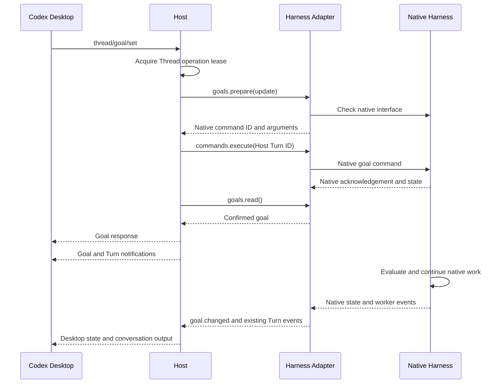

# Native Harness goals

## Decision

codex-z can support `/goal` through native Harness interfaces. The Claude Code error, `External Harness does not expose the requested command`, was a command catalog and routing limit. It was not proof that Claude Code cannot run goals.

This implementation connects the Desktop goal protocol to Claude Code and DeepSeek Harness. It adds an optional public goal contract for other plugins. Each Adapter must confirm native support before it starts work. The Host does not evaluate a goal, submit repeated prompts, or implement a token budget.

A native terminal command does not prove that the same feature is available through SDK, ACP, RPC, or headless mode. The assessment below distinguishes those interfaces. Evidence was checked on 2026-10-02. An upstream version or installed plugin can change the result.

## Ownership and request order

The Host routes `thread/goal/get`, `thread/goal/set`, and `thread/goal/clear` for external Threads. Official Codex Threads keep their native route. An older plugin without `session.goals` returns no goal on read and an `unsupported` error on mutation.

`HarnessGoalCapability` has three operations:

- `read`: return current native facts. Omit counters which the interface does not supply.
- `prepare`: validate a requested change and select its native command. Do not mutate state.
- Optional `control`: use native controls without command admission. Publish any native Turns which the operation starts.

The Adapter publishes `goal.changed`. The Host projects the Desktop `thread/goal/updated` or `thread/goal/cleared` notification. Notifications have no inferred Turn association. Goal responses precede their goal notifications. Command Turn projection stays gated until the response is written.

Set and clear requests retain the operation lease until native confirmation. An active goal retains the writer lease and prevents idle Session release between worker Turns. A paused or removed goal allows release after other work ends. When the output channel faults or ends, the Host discards its current goal observation; it does not publish a false clear or infer native completion. Native stop failures remain Adapter errors. Closing a DeepSeek Session with a known active goal first pauses native continuation, then stops any worker.

A command which accepts durable work reports `persistTurn: true`. The Host retains history and records usage from Turn start. A native Turn identity also makes its terminal result durable. This matters for Claude goal commands, which can start real model work. Local commands without that identity keep the existing temporary Turn behavior. Native worker history, checkpoints, tool events, approvals, questions, and usage use the existing Adapter paths.

## Supported operations

| Operation | Claude Code | DeepSeek Harness |
| --- | --- | --- |
| Set or replace objective | Native headless `/goal <condition>`; check installed command metadata first | Native `/goal`; existing non-complete goals use native `edit` |
| Read | Native `active_goal`, synthetic local-command receipts, and durable goal attachments on resume | Native `goals/get`; validate goal ID, revision, phase, and activation |
| Pause | Interrupt native work and retain the condition | Native `goals/pause` with current ID and revision |
| Resume | Submit one normal native prompt; the retained native hook continues work | Native `goals/resume` with current ID and revision |
| Clear | Stop the active Turn, then execute native `/goal clear` | Native `goals/clear` with current ID and revision |
| Completion | A native clear means no current goal. It does not prove success | Native goal phase can report `complete` or `blocked` |
| Token budget | Unsupported; reject a non-null budget | Unsupported; native round limits are not token limits |
| Goal token/time counters | Not supplied by the mapped native interface | Not supplied by the mapped native view |

Claude pause cannot stop a retained background-completion segment through the headless interrupt interface. That operation returns `unsupported`. Clear waits for native Turn stop before it removes the goal. A stop timeout does not submit a clear command. Resume is rejected while worker activity is already present. Recovery retains the native condition in a paused state until a prompt starts native work.

The Claude observer accepts native `active_goal` records and synthetic `local_command_run.command === "goal"` receipts. Model text such as “Goal set” cannot confirm a command. Trust and Hook policy rejection are returned as errors. The public SDK message union does not include every internal goal message; the observer validates those records before use. Native trust, permissions, evaluation, and persistence remain native responsibilities. See the [Claude goal reference](https://code.claude.com/docs/en/goal).

DeepSeek preserves the distinction between durable phase and process-local activation. An active but disarmed native goal is shown as paused. Controls use native compare-and-set references. A stale mutation is not retried. Reads and controls are serialized in the Adapter so an earlier read cannot overwrite a later control result. Native evaluation, scheduling, round limits, and durable changes remain in the native Goal service. See the [native Goal subsystem](https://github.com/deepseek-ai/deepseek-harness/blob/639ed015397290b3745d163aafe02ffee4aa3f84/docs/subsystems/goal.md).

`/goal` is the canonical command in both catalogs. DeepSeek retains `/dsh-goal` as a compatibility alias. The global live-command exclusion for `goal` remains in place. Only a reviewed Adapter command can bypass it. Existing Antigravity command handling is unchanged.

The Desktop protocol requires numeric counters. Missing native counters are projected as `0`, and missing token budgets as `null`. These values do not certify zero consumption. The normal usage ledger is separate. Goal counters and hard token budgets require native support before they can be added.

## Assessment of all preinstalled Harnesses

“Further integration” means there is native evidence, but this change does not enable the structured Desktop goal interface for that Harness. A slash command alone does not establish a working state, control, history, or continuation path.

| Harness | Native evidence and present interface | Assessment |
| --- | --- | --- |
| Claude Code | Installed CLI `2.1.284` advertises built-in `goal` through SDK `0.3.220`. Headless local-command acknowledgements and goal state records were inspected. | Implemented, subject to installed command support and native policy. |
| DeepSeek Harness | Native Goal service has state, ID/revision controls, and a scheduler. Existing Modern Adapter has native command and autonomous worker paths. | Implemented. A deployment must expose the native Goal service. |
| Grok | Native ACP Session actor owns goals and goal slash controls. Native goal code includes actual token-budget semantics. | Further integration is possible. Map ACP goal state, controls, budgets, and worker events. The CLI was not installed for live checks. |
| Hermes | Native gateway owns goals. Goal input uses `command.dispatch`, with a native `send` or `exec` result. Legacy ACP does not implement this capability. New upstream session controls also differ from the installed `0.20.6` gateway. | Further integration is possible through a qualified gateway version. Do not enable `/goal` on legacy ACP or send it through `slash.exec`. |
| Qoder | Native CLI and current SDK documentation describe persistent goals and controls. The pinned Adapter SDK `1.0.39` lacks the newer goal control declarations. | Qualify a compatible SDK and map state, controls, native turn limits, and ownership. A native SDK upgrade is required before structured support can be claimed. |
| Qoder CN | Shares the Adapter implementation, but uses a separate executable and package. | Same integration requirement as Qoder. Qualify the CN runtime separately. |
| CodeBuddy | Official documentation describes headless goals and Web UI ACP goal broadcasts and controls. | Further integration is possible with a verified native version and ACP mapping. The native CLI was not installed for live checks. |
| WorkBuddy | Uses a bundled runtime and CodeBuddy-derived Adapter. CodeBuddy documentation explicitly distinguishes Web UI ACP from WorkBuddy `--acp`. | Undetermined for the bundled runtime. CodeBuddy support does not prove WorkBuddy support. Requires independent interface evidence. |
| Kiro CLI | Official CLI documentation describes `/goal`, clear, and iteration limits. The Adapter uses versioned ACP command execution. | Further integration may be possible. Confirm the operation and state events in each supported ACP version. Terminal documentation is insufficient. |
| Cursor CLI | Official slash documentation lists `/goal` as a rollout feature. The current Adapter uses experimental ACP. | Undetermined for the installed ACP interface. Confirm feature availability and goal state/control events before enabling it. |
| Antigravity | Native documentation lists `/goal`. The current Adapter already has a curated native goal command, but no structured goal state contract. | Existing command remains. Structured Desktop support needs headless state/control and continuation checks. CLI `1.2.14` was present; no live goal model run was done. |
| OMP | Native `/goal` is a terminal-only built-in (`handleTui`). The current RPC dispatcher requires `handle`, and RPC types have no goal operation. | Hard limit of the inspected RPC interface. Requires a native interface extension. Sending raw prompt text does not remove this limit. |
| Kimi Code | Native server API has goal state, controls, and WebSocket updates. The inspected ACP built-in command implementation has no goal operation. | Possible through native server transport work or an upstream ACP extension. The current ACP Adapter cannot expose it directly. |
| Pi | Default RPC interface has no native goal service. Native extensions can register commands, persist entries, and send messages. | Requires a verified installed native extension. The Host must not construct its own evaluator loop. |
| OpenCode | Inspected built-in command source has no goal service. Native plugins can add capabilities. Current Adapter exposes fixed compaction. | Requires a verified native plugin or upstream interface. Ordinary prompt continuation is not a native goal feature. |

Primary evidence for the matrix:

- [Grok native goal implementation](https://github.com/xai-org/grok-build/blob/2bdd1d6a6369de0e8c68132ea4539e9abd9e14a8/crates/codegen/xai-grok-shell/src/session/acp_session_impl/goal.rs).
- [Hermes gateway control implementation](https://github.com/NousResearch/hermes-agent/blob/5bba024d8ddd388f56f354c1f789be825e3d8a3c/tui_gateway/methods_session_control.py) and [goal command tests](https://github.com/NousResearch/hermes-agent/blob/5bba024d8ddd388f56f354c1f789be825e3d8a3c/tests/tui_gateway/test_goal_command.py).
- [Qoder goal command reference](https://docs.qoder.com/cli/goal-reference).
- [CodeBuddy goal reference](https://www.codebuddy.ai/docs/cli/goal).
- [Kiro CLI goal reference](https://kiro.dev/docs/cli/chat/goal/).
- [Cursor slash command reference](https://cursor.com/docs/cli/reference/slash-commands).
- [Antigravity slash command reference](https://antigravity.google/docs/slash-commands/) and [headless interface](https://www.antigravity.google/docs/cli/headless/).
- [OMP native built-in modes](https://github.com/can1357/oh-my-pi/blob/cb0d5295e5edd48d000c1979e195186ec92aac79/packages/coding-agent/src/slash-commands/builtin-modes.ts) and [RPC dispatcher](https://github.com/can1357/oh-my-pi/blob/cb0d5295e5edd48d000c1979e195186ec92aac79/packages/coding-agent/src/modes/rpc/rpc-mode.ts).
- [Kimi native server API](https://moonshotai.github.io/kimi-code/en/reference/server-api.html) and [ACP built-ins](https://github.com/MoonshotAI/kimi-code/blob/21406fb4c805cc8c715e6d1f16ad3fb5f25f4fe3/packages/acp-server/src/builtin-commands.ts).
- [Pi native extensions](https://github.com/earendil-works/pi/blob/7fbbd5f4a1d982bb02d63472dde0774fa639f99b/packages/coding-agent/docs/extensions.md).
- [OpenCode built-in commands](https://github.com/anomalyco/opencode/blob/a79ecfe109294909a239c98fb89f02979d5aa10b/packages/opencode/src/command/index.ts).

## Validation boundary

Focused tests cover native receipt validation, trust rejection, retained-hook resume, clear-after-stop order, cancellation timeout, native CAS controls, state parsing, Desktop response order, unsupported plugins, and active-goal lease and idle-release behavior. Existing command, steering, official routing, and Session tests provide regression coverage.

A live Claude command metadata check confirmed `/goal`. A live `/goal clear` check confirmed a synthetic native acknowledgement and the persisted caller-assigned message ID. The mapped SDK transport was also checked with the model-free clear operation.

A live goal-set probe received the native goal acknowledgement, but configured Claude Models were unavailable. It did not prove evaluator continuation or successful completion. DeepSeek and the other Harness goal loops were not run live. These checks do not prove native Desktop GUI behavior, Windows behavior, hosted CI, or every upstream version.

To qualify another Adapter, first confirm its native interface and version. Then map its state and controls through `HarnessGoalCapability`, preserve its existing worker/history path, and test native set, continuation, stop, clear, recovery, and limits. Enable a curated `/goal` command only after that mapping exists.
